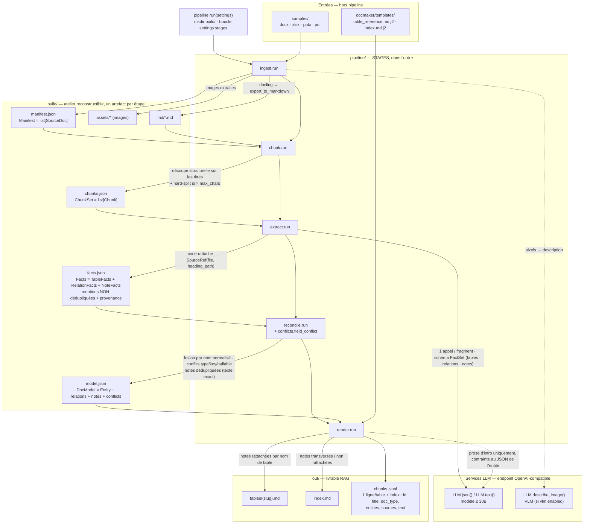
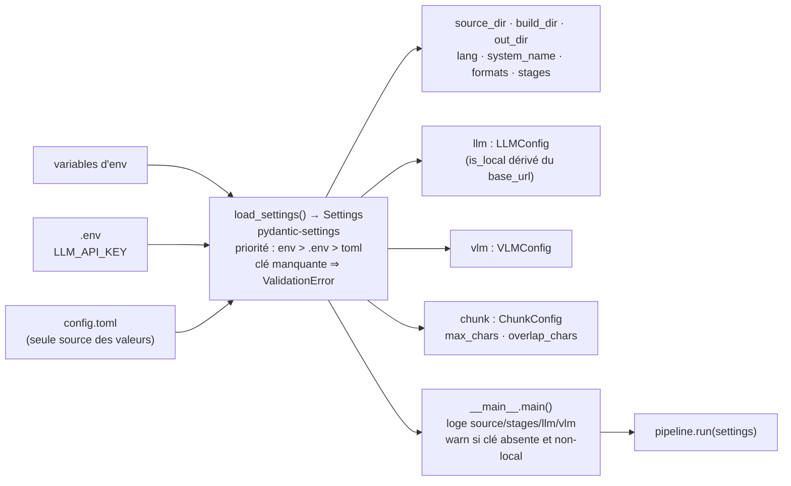
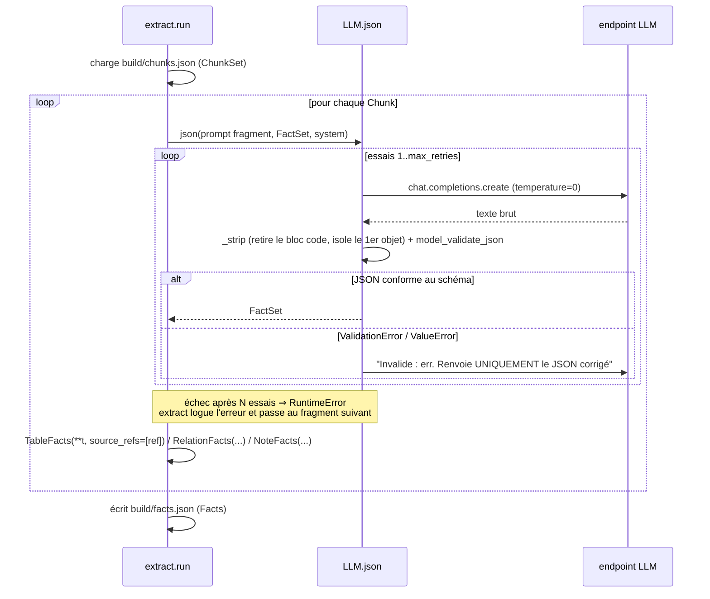

# docmaker

Génère une documentation structurée et _RAG-ready_ d'un système de base de données
à partir de sources hétérogènes (`.docx`, `.xlsx`, `.pptx`, `.pdf`).

Pipeline : `docling` → fragments → extraction par LLM (faits structurés +
notes libres) → réconciliation (+ conflits) → Markdown à frontmatter + `chunks.jsonl`.

## Installation

```sh
mise use python@3.12      # ou pyenv/asdf — l'écosystème docling n'est pas fiable sur 3.14
poetry install
cp .env.example .env      # renseigner LLM_API_KEY (OpenRouter en test)
```

## Utilisation

Tout se configure dans `config.toml` — **aucune option en ligne de commande**.

```sh
cp mes_docs/* samples/
poetry run docmaker
```

- Artefacts intermédiaires : `build/`
- Documentation finale : `out/` (`index.md`, `tables/*.md`, `chunks.jsonl`)

Pour rejouer une seule étape, ajuster `stages` dans `config.toml`
(ex. `stages = ["extract", "reconcile", "render"]` pour itérer sans re-convertir).

## Étapes

| Étape       | Entrée              | Sortie                                 |
| ----------- | ------------------- | -------------------------------------- |
| `ingest`    | `samples/`          | `build/md/*.md`, `build/manifest.json` |
| `chunk`     | `build/md/`         | `build/chunks.json`                    |
| `extract`   | `build/chunks.json` | `build/facts.json`                     |
| `reconcile` | `build/facts.json`  | `build/model.json`                     |
| `render`    | `build/model.json`  | `out/*.md`, `out/chunks.jsonl`         |

## Architecture

Trois vues : le flux de données bout-en-bout, le chargement de la config, et la
boucle interne de `extract`.

### 1. Flux de données du pipeline



### 2. Chargement de la configuration



### 3. Boucle interne de `extract` (JSON best-effort + retries)



### Points clés

- **Une seule direction :** `samples/` (jamais écrit) → `build/` (jetable,
  reconstructible) → `out/` (expédié, écrit par `render` seul).
- **Provenance ajoutée par le code, pas par le LLM :** le modèle ne renvoie qu'un
  `FactSet` plat ; `extract` et `reconcile` attachent/propagent les `SourceRef`.
- **Dédup tardive :** `facts.json` contient N mentions par table ; `reconcile`
  fusionne en une `Entity` et déverse les désaccords dans `conflicts`.
- **Faits + notes :** `extract` produit le modèle structuré (`tables`,
  `relations`) _et_ des `notes` en texte libre pour le contenu hors-schéma
  (règle métier, cycle de vie, rétention, glossaire…), rattachées à une table
  par nom ou classées transverses. Mêmes rails, même provenance ; elles
  atterrissent dans les fiches et dans l'index. Un doc 100 % prose n'est plus
  perdu, et le rattachement se fait au (re)run suivant dès que la table existe.
- **LLM cantonné :** extraction structurée + notes (`extract`) + 2–4 phrases
  d'intro (`render`) + description d'images (VLM). Les tableaux de colonnes sont
  rendus déterministiquement par Jinja.
- **`chunks.json` (build, fragments source pour le LLM) ≠ `chunks.jsonl` (out,
  unités RAG finales)** — noms proches, rôles opposés.

## Tests

```sh
poetry run pytest
```

## Docs

- `docs/architecture-review.md` — revue d'archi, risques, benchmark, glossaire
- `docs/decisions.md` — choix d'implémentation de la v1 et limites assumées
